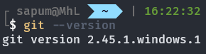

# Open-Source Practice

Welcome to the repository where you can raise a Pull Request to practice contributing to open-source projects! 🎉 Follow the steps below, or if you prefer, watch this instructional video: [VIDEO PLACEHOLDER].

<br/>
 
## Tools

Before we begin, ensure you have Git installed on your computer: [Download Git](https://www.git-scm.com/) <br/>
You can verify that Git is installed by running the following command in your terminal :

```bash
git --version
```



<br/>

## Steps 🪜

### 1. Fork This Repository

- Click the gray `Fork` button at the top right of this page.
- This creates a copy of the project in your GitHub account.

<br/>

### 2. Clone Your Fork

- After forking the repository, copy the repository URL.
- Use the command below to clone the repository to your local machine:

```bash
git clone <repository_url> .
```

Example:

```bash
git clone https://github.com/Web-Dev-Crew/open-source-practice.git .
```

<br/>

### 3. Edit the Code

- Create a new branch by running:
  ```bash
  git branch <branch_name>
  ```
  Example:
  ```bash
  git branch openSourcePractice
  ```

<br/>
 
- Switch to your new branch:
  ```bash
  git switch <branch_name>
  ```
  Example:
  ```bash
  git switch openSourcePractice
  ```
  
<br/>
 
- Add your name to the `index.html` file inside a `<div>` tag:
  ```html
  <div>YourName</div>
  ```
  Example:
  ```html
  <div>MhL5</div>
  ```
  
<br/>
 
- Stage your changes:
  ```bash
  git add .
  ```
  
<br/>
 
- Commit your changes with a message:
  ```bash
  git commit -m "Add my name"
  ```
  
<br/>
 
- Push your changes to GitHub:
  ```bash
  git push -u origin <branch_name>
  ```
  Note: If it's your first time pushing, you might be prompted to enter your email and name, and to log in to GitHub.

<br/>
 
### 4. Send a Pull Request

- Open your forked repository on GitHub.
- Click on `Compare & pull request`.
- Ensure you are comparing the `Web-Dev-Crew/open-source-practice` `main` branch with your forked repository's branch that you made and switched into.
- Write a title and description for your pull request.
- Create your pull request.

Congratulations!🎉 You are done. Sit tight and wait for your pull request to be reviewed and merged.
